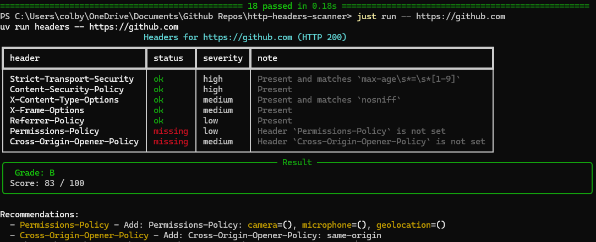

# http-headers-scanner


A command-line tool that scans a URL for important HTTP security headers and grades the site from A to F.

It checks seven headers (HSTS, CSP, X-Content-Type-Options, X-Frame-Options, Referrer-Policy, Permissions-Policy, and Cross-Origin-Opener-Policy), weights them by severity, and prints a table with a score and recommendations for anything missing or weak.



## Why I built this

I'm a cybersecurity student who regularly competes in CTFs, and I'm always looking for ways to deepen my understanding of the field. CTFs are great for learning how attacks work, but I wanted to spend time on the defensive side too: what a well-configured site does to protect its users, and how to check that automatically.

Security headers are a good place to start. Each one is a small, concrete defense against a real attack class:

- **HSTS** against SSL-stripping
- **CSP** against cross-site scripting
- **X-Frame-Options** against clickjacking
- **X-Content-Type-Options** against MIME-sniffing
- **Cross-Origin-Opener-Policy** against cross-origin attacks like Spectre

Building a scanner for them meant I had to understand what each header does, which values count as strong or weak, and how to turn that into a score people can act on. It also gave me practice with the engineering side of security tooling: writing testable code, mocking network calls, building a CLI that works in CI pipelines, and scanning many hosts concurrently.

I built this by following a guided project and then extended it myself (see [Credits](#credits)). I'd like to keep growing it and building more tools like it as I learn.

## Features

- Colored table output with a grade (A-F) and a score out of 100
- `--json` flag for machine-readable output (pipe it into `jq`, CI, or dashboards)
- `--min-grade` threshold so CI can fail a build when a site is below your bar
- Async scanning of many URLs at once (`scan_many`) with a concurrency limit
- Fast, offline tests (network calls are mocked with `respx`)
- Works on Windows, Linux, macOS, and WSL

## Install

You need [uv](https://docs.astral.sh/uv/). The install steps below set it up if it's missing.

### Linux, macOS, WSL

```bash
git clone <your-repo-url>
cd http-headers-scanner
./install.sh
```

The script installs uv from astral.sh if you don't have it, then installs the `headers` command. Restart your terminal afterward.

### Windows (PowerShell)

```powershell
winget install --id astral-sh.uv
git clone <your-repo-url>
cd http-headers-scanner
uv tool install .
```

Restart your terminal if `headers` isn't found. If it still isn't, run `uv tool update-shell` and restart again.

## Usage

```bash
headers https://github.com
headers https://github.com --json
headers https://github.com --min-grade B
headers https://github.com --timeout 5
```

| Option | Description |
| --- | --- |
| `url` | Full URL to scan (must include `http://` or `https://`) |
| `--timeout` | Seconds before giving up on the request (default: 10) |
| `--json` | Print the report as JSON instead of a table |
| `--min-grade` | Lowest acceptable grade: A, B, C, D, or F (default: C) |

### Exit codes

| Code | Meaning |
| --- | --- |
| 0 | Grade met or beat `--min-grade` |
| 1 | Grade is below `--min-grade` |
| 2 | The request failed (timeout, DNS error, etc.) |

This makes it easy to use in CI:

```bash
headers https://example.com --min-grade B || echo "Security headers need work"
```

Get just the score with `jq`:

```bash
headers https://example.com --json | jq '.score'
```

## Scoring

Each header is worth points based on severity: high = 30, medium = 15, low = 5. A header that is present and valid earns full points, a header that is present but weak (for example `max-age=0` on HSTS) earns half, and a missing header earns none. The score is the percentage of possible points earned.

| Score | Grade |
| --- | --- |
| 90+ | A |
| 80-89 | B |
| 70-79 | C |
| 60-69 | D |
| below 60 | F |

Note that this tool only grades the headers listed above. A low grade means those specific headers are missing, not that a site is insecure overall.

## Using it from Python

```python
import asyncio
from http_headers_scanner import scan, scan_many

report = scan("https://example.com")
print(report.grade, report.score)

results = asyncio.run(scan_many(["https://example.com", "https://python.org"]))
for result in results:
    # Failed requests come back as exception objects instead of crashing the batch
    print(result if isinstance(result, Exception) else result.grade)
```

## Development

```bash
uv sync          # create .venv and install dependencies
just test        # run the tests
just lint        # run ruff
just run https://example.com --json
```

[just](https://github.com/casey/just) is optional. Without it, use `uv run pytest -v` and `uv run headers <url>`.

## Project layout

```
http-headers-scanner/
├── http_headers_scanner.py        # rules, scoring, async scanning, CLI
├── test_http_headers_scanner.py   # tests, network mocked with respx
├── pyproject.toml                 # dependencies and tool config (uv)
├── uv.lock                        # pinned dependency versions
├── justfile                       # test, run, and lint shortcuts
├── install.sh                     # one-command setup for Linux/macOS/WSL
├── README.md
└── LICENSE
```

## Credits

Built by following the guided project from
[CarterPerez-dev/Cybersecurity-Projects](https://github.com/CarterPerez-dev/Cybersecurity-Projects),
then extended with:

1. A seventh rule for `Cross-Origin-Opener-Policy`
2. A `--json` output mode
3. A `--min-grade` threshold for CI use
4. Async multi-URL scanning with per-URL error handling

## License

MIT. See [LICENSE](LICENSE).